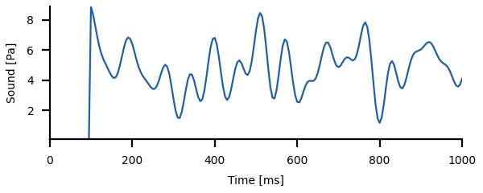
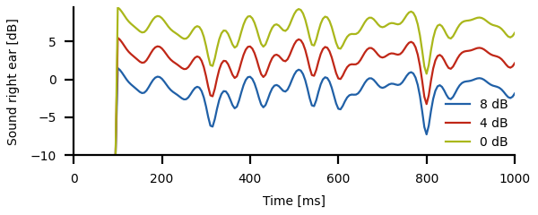
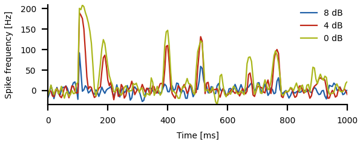
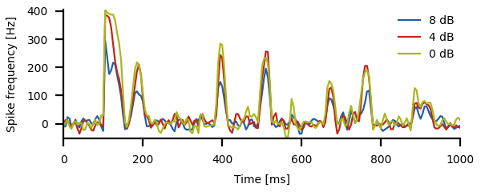
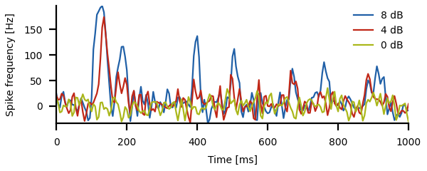
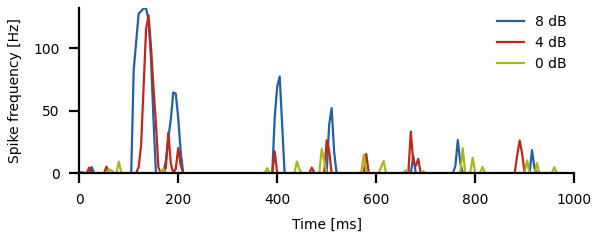

# Resolving ambiguities

Change into the `ambiguities/` directory and run
``` sh
python3 ambiguities.py
```
for a demo.

In the following a simplified version of the Hildebrandt et al. (2015)
model on extracting sound localization information despite adaptation
in the periphery is discussed. See the
[`ambiguities.py`](ambiguities.py) script for the full functions.


## Responses of auditory receptors

The firing rate responsee of an auditory receptor neuron, to a first
approximation, follows the amplitude modulation of the sound stimulus
on a logarithmic scale. So we simply take the amplitude modulation as
a stimulus. Here we use a band-limited white noise for the amplitude
modulation. And this is the stimulus for the left ear:

``` py
dt = 0.005
tmax = 1.0
am_left = 5.0*(1.0 + 0.3*whitenoise(0.0, 20.0, dt, tmax))
time = np.arange(len(am_left))*dt
am_left[time<0.1] = 0.0       # no stimulus at beginning
```



The stimulus to the right ear is attenuated relative to the one to the
left ear by some attenuation factor given in decibels. We want to
compare the responses to different attenuation factors, that is why we
use a `for` loop to cycle through three different values for the
attenuation.

``` py
decibels = [8.0, 4.0, 0.0]
for k, dbs in enumerate(decibels):
    ampl = 10**(-0.1*dbs)     # attenuation factor from decibels
    am_right = ampl*am_left   # attenuate stimulus for right ear
```

The auditory receptor extract the amplitude and respond linearly to
the logarithm of the amplitude modulation. This is why we convert the
stimulus for the left and the right ear to decibels.

``` py
    db_left = 10.0*np.log10(am_left)
    db_right = 10.0*np.log10(am_right)
```


The spike frequency response of the auditory receptors is mildly adapting

``` py
    rate_left, _ = adaptation(time, db_left, taua=0.5, alpha=0.4)
    rate_right, _ = adaptation(time, db_right, taua=0.5, alpha=0.4)
```

and we add some intrinsic noise to the receptor responses:
``` py
    rate_left += 10.0*whitenoise(0.0, 60.0, dt, tmax)
    rate_right += 10.0*whitenoise(0.0, 60.0, dt, tmax)
```




## Pattern encoder

The responses of the left and the right ear are simpy summed up by the
pattern encoding neuron:

``` py
    rate_sum = rate_left + rate_right
```




## Encoding sound direction

The sound localization neuron needs to compute the difference between
the responses from the left and the right ear:

``` py
    rate_diff = rate_left - rate_right
```



But this is quite noisy and does not always encode sound direction
(i.e. attenuation level between the ears) faithfully. Becasue of the
peripheral adaptation and noise, information about sound direction is
ambiguous in the receptor responses.

Strong intrinsic adaptation on the difference between the two ears
largely removes this wrong information and this way resolves the
problem of ambigous information about sound direction:

``` py
    rate_diff_adapt, _ = adaptation(time, rate_diff, taua=10.0, alpha=50.0, slope=0.01)
```

Because we need strong intrinsic adaptation, i.e.  a large value for
the adaptation strength `alpha`, we need a longer adaptation time
constant such that the resulting effective adaptation time constant
roughly matches the one of the receptor responses.




> Explore this problem further by
> - changing/switching off the receptor noise,
> - modifying the adaptation strength time constant of the intrinsic
>   adaptation of the sound direction encoder,
> - changing the slopes of the *f-I* curves and that way influence the
>   effect of response saturation,
> - using a periodic pulse stimulus instead of the noise stimulus.


## References

> Hildebrandt KJ, Ronacher B, Hennig RM, Benda J (2015) A neural mechanism for time-window separation resolves ambiguity of adaptive coding. *PLoS Biol* 13:e1002096.


## Next

Continue reading about [sparse codes](../sparse/README.md).
