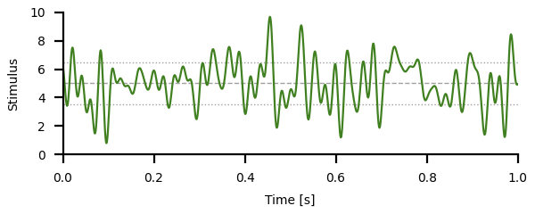

# Adaptation high-pass filter

Change into the `filter/` directory and run
``` sh
python3 filter.py
```
for a demo.

In the following, key concepts of the model and the respective code
are briefly described. See the [`filter.py`](filter.py) script for the
full functions.


## White noise stimulus

The transfer function of a neuron characterizes its linear
input-output relation between stimulus and response by a gain and a
phase shift for each frequency component of a stimulus. For measuring
the transfer function we need to stimulate the neuron with a stimulus
that contains many different frequencies. One such stimulus is a
band-limited Gaussian white noise. In this stimulus all frequencies up
to a cutoff frequency have the same power. This is why is is called
"white" noise, because if the frequencies would be light waves in the
visible spectrum it would appear white. The frequency components are
independent of each other, they have random phases. The amplitude
distribution of such a stimulus is Gaussian.

To generate a white noise, we draw for each frequency above a lower
cutoff frequency `cflow` and an upper cutoff frequency `cfup` a random
number in the complex Fourier domain, by drawing one number for the
real part and one for the imaginary part, each from a Gaussian
distribution. By means of an inverse Fourier transformation the
stimulus in transformed back into the time domain.
``` py
def whitenoise(cflow, cfup, dt, duration, rng=np.random):
    # number of elements needed for the noise stimulus:
    n = int(np.ceil((duration+0.5*dt)/dt))
    # next power of two:
    nn = int(2**(np.ceil(np.log2(n))))
    # indices of frequencies with `cflow` and `cfup`:
    inx0 = int(np.round(dt*nn*cflow))
    inx1 = int(np.round(dt*nn*cfup))
    if inx0 < 0:
        inx0 = 0
    if inx1 >= nn/2:
        inx1 = nn/2
    # draw random numbers in Fourier domain:
    whitef = np.zeros((nn//2+1), dtype=complex)
    if inx0 == 0:
        whitef[0] = rng.randn()
        inx0 = 1
    if inx1 >= nn//2:
        whitef[nn//2] = rng.randn()
        inx1 = nn//2-1
    m = inx1 - inx0 + 1
    whitef[inx0:inx1+1] = rng.randn(m) + 1j*rng.randn(m)
    # scaling factor to ensure standard deviation of one:
    sigma = 0.5 / np.sqrt(float(inx1 - inx0))
    # inverse FFT:
    noise = np.real(np.fft.irfft(whitef))[:n]*sigma*nn
    return noise
```


The returned noise stimulus has an average of zero and a unit standard
deviation.  By multiplying the noise with a number one can modify the
standard deviation. Adding a number modifies the mean of the noise:

```
dt = 0.001              # integration time step in seconds
tmax = 1.0              # stimulus duration in seconds
cutoff = 50.0           # highest frequency in stimulus in Hertz
mean = 5.0              # stimulus mean
stdev = 2.5             # stimulus standard deviation
stimulus = mean + stdev*whitenoise(0.0, cutoff, dt, tmax)
```



> Plot the white noise stimulus for different cutoff frequencies.

> Plot a histogram of the white noise stimulus amplitudes.

> Check the mean and standard deviation of the white noise stimulus.

> How close are the mean and the standard deviation of the white noise
> stimulus to the requested ones? Check this for various stimulus
> durations of, for example, 1s, 10s, 100s, 1000s.


