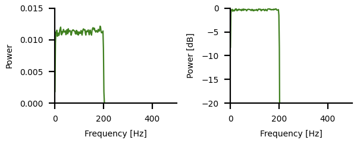
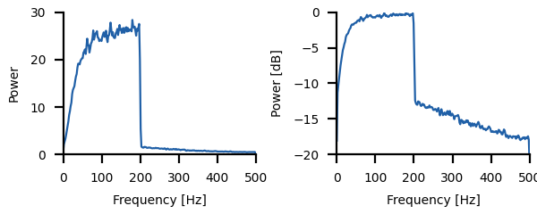
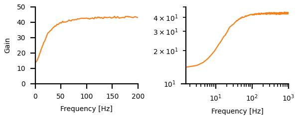
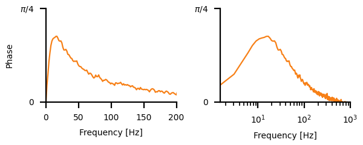
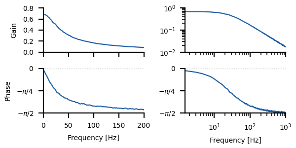
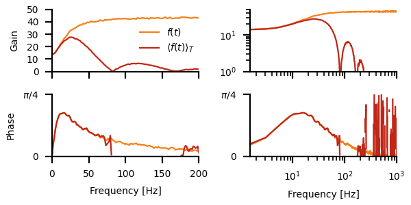

# Adaptation high-pass filter

Change into the `filter/` directory and run
``` sh
python3 filter.py
```
for a demo.

In the following, key concepts of power spectra, cross spectra and
transfer functions as well as the respective code are briefly
described. See the [`filter.py`](filter.py) script for the full
functions.


## White noise stimulus

The transfer function of a neuron (actually of any system)
characterizes its linear input-output relation between stimulus and
response by a gain and a phase shift for each frequency component of a
stimulus. For measuring the transfer function we need to stimulate the
neuron with a stimulus that contains many different frequencies. One
such stimulus is a band-limited Gaussian white noise. In this stimulus
all frequencies up to a cutoff frequency have the same power. This is
why is called "white" noise, because if the frequencies would be light
waves in the visible spectrum, the light would appear white. The
frequency components are independent of each other, they have random
phases. The amplitude distribution of such a stimulus is Gaussian.

To generate a white noise, we draw for each frequency above a lower
cutoff frequency `cflow` and an upper cutoff frequency `cfup` a random
number in the complex Fourier domain with magnitude one and random
phase. By means of an inverse Fourier transformation the stimulus in
transformed back into the time domain.
``` py
def whitenoise(cflow, cfup, dt, duration, rng=np.random):
    # number of elements needed for the noise stimulus:
    n = int(np.ceil((duration+0.5*dt)/dt))
    # next power of two:
    nn = int(2**(np.ceil(np.log2(n))))
    # indices of frequencies with `cflow` and `cfup`:
    inx0 = int(np.round(dt*nn*cflow))
    inx1 = int(np.round(dt*nn*cfup))
    if inx0 < 0:
        inx0 = 0
    if inx1 >= nn/2:
        inx1 = nn/2
    # draw random numbers in Fourier domain:
    whitef = np.zeros((nn//2+1), dtype=complex)
    # zero and nyquist frequency must be real:
    if inx0 == 0:
        whitef[0] = 0
        inx0 = 1
    if inx1 >= nn//2:
        whitef[nn//2] = 1
        inx1 = nn//2-1
    phases = 2*np.pi*rng.rand(inx1 - inx0 + 1)
    whitef[inx0:inx1+1] = np.cos(phases) + 1j*np.sin(phases)
    # inverse FFT:
    noise = np.real(np.fft.irfft(whitef))
    # scaling factor to ensure standard deviation of one:
    sigma = nn / np.sqrt(2*float(inx1 - inx0))
    return noise[:n]*sigma
```


The returned noise stimulus has zero mean (dashed line) and unit
standard deviation (dotted lines).  By multiplying the noise with a
number one can modify the standard deviation. Adding a number modifies
the mean of the noise:

``` py
dt = 0.001              # integration time step in seconds
tmax = 1.0              # stimulus duration in seconds
cutoff = 50.0           # highest frequency in stimulus in Hertz
mean = 5.0              # stimulus mean
stdev = 1.5             # stimulus standard deviation
stimulus = mean + stdev*whitenoise(0.0, cutoff, dt, tmax)
```


> Plot the white noise stimulus for different cutoff frequencies.

> Plot a histogram of the white noise stimulus amplitudes.

> Check the mean and standard deviation of the white noise stimulus.

> How close are the mean and the standard deviation of the white noise
> stimulus to the requested ones? Check this for various stimulus
> durations of, for example, 1s, 10s, 100s, 1000s.


## Power spectrum of the stimulus

The power spectrum of the stimulus tells us the power, i.e. the
squared amplitude, of each frequency component of the stimulus.  For
estimating the power spectrum the stimulus is chopped in a number of
segments each containing `nfft` elements. Each segment is first
multiplied with a window function to reduced edge effects and then
Fourier transformed. The squared Fourier transforms are then averaged
over the segments.

Luckily, there is a function doing this for us: `welch()` in
`scipy.signals`. It takes a time series (our stimulus) as an input and
returns an array with frequencies and an array with the powers for
each frequency. We need to provide the sampling rate of our data,
i.e. the inverse time step, via the `fs` argument to the `welch()`
function.

The most important parameter is the length of the segments, `nfft`
(the `nperseg` argument to the `welch()` function). The lowest
frequency the `welch()` function returns, and also the frequency
resolution (the difference between successive frequencies), is the
inverse of the duration of the segments, i.e. `nfft*dt`. This is the
period of a sine fitting into the segment. The larger `nfft`, the
longer the segment, the higher the frequency resolution. Choose for
`nfft` values that are powers of two. For those the Fourier
transformation is most efficient. Start with `nfft=2**10`. Needless to
say that your stimulus needs to contain at least this many
samples. Better are at least five times more. The more data are
provided to the `welch()` function, the higher the number of segments
that can be averaged, the better (less noisy) the estimate of the
spectrum.

The maximum frequency returned is half the sampling rate. This is the
Nyquist theorem. To be able to detect a sine wave of a give frequency,
the sampling rate must be at least twice as fast. At least two samples
per period of the sine wave are needed for a proper estimate of its
frequency.

Note also that the returned power values are a power spectral
*density*.  They have the unit $x^2/{\rm Hz}$, with $x$ being the unit
of the data values and ${\rm Hz}$ is the frequency unit of the
supplied `fs` parameter.

``` py
import scipy.signal as sig
tmax = 100.0           # more than just a second!
cutoff = 200.0
stimulus = mean + stdev*whitenoise(0.0, cutoff, dt, tmax)
nfft = 2**10
freqs, psd = sig.welch(stimulus, fs=1.0/dt, nperseg=nfft)
ax.plot(freqs, psd)
```



The power is usually plotted on a logarithmic scale by transforming
the power values to decibel relative to the maximum power or some other
reference power.

``` py
pref = np.max(psd)
dbpsd = 10.0*np.log10(psd/pref)  # decibel relative to pref
ax.plot(freqs, dbpsd)
ax.set_ylim(-20, 0)
```

> Compare power spectra of the stimulus using different values of `nfft`.

> Also vary the duration of the stimulus.

> For which values of `nfft` and the stimulus duration do you get
> smoother power spectra?


## Power spectrum of the response

In the very same way as for the stimulus we can estimate a power
spectrum of the neuronal response. Let us simulate the firing rate of
an adapting neuron and compute its power spectrum:
``` py
stimulus = mean + stdev*filter.whitenoise(0.0, cutoff, dt, tmax)
time = np.arange(len(stimulus))*dt
rate, adapt = adaptation(time, stimulus, alpha=0.05, taua=0.02)
freqs, psd = sig.welch(rate, fs=1.0/dt, nperseg=nfft)
```



These spectra differ in two respects from the stimulus spectra. First,
we see the high-pass filter effect of adaptation. Low frequency
components are attenuated. Second, we have power at frequencies higher
than the cutoff frequency of the stimulus. This high-frequency power
results from the non-linear shape of the *f-I* curves.

> How does the adaptation time constant influence the response spectrum?

> Vary the stimulus mean and standard deviation. Do they influence the
> response spectrum?


## Transfer function

The transfer function relates the response to the stimulus at each
frequency component. It is computed from the cross-spectrum between
stimulus and response (`scipy.signal.csd()` function), divided by the
power spectrum of the stimulus. The cross spectrum is very similar to
a power spectrum. Instead of taking the square of the Fourier
transformation of a signal, it multiplies the Fourier transformations
of two different signals, here the ones of the response and the
stimulus.

``` py
freqs, csd = sig.csd(stimulus, rate, fs=1.0/dt, nperseg=nfft)
freqs, psd = sig.welch(stimulus, fs=1.0/dt, nperseg=nfft)
transfer = csd/psd
```

Since we divide by the stimulus power spectrum, and since by
construction of the white noise stimulus there is no stimulus
component at frequencies higher than the cut-off frequency, the
transfer function at frequencies beyond the cut-off frequency of the
stimulus is not meaningful (division by zero!). We therefore only keep
values below the cutoff frequency:

``` py
transfer = transfer[freqs<cutoff]
freqs = freqs[freqs<cutoff]         # this line last!
```

The transfer function is a complex valued function of the
frequencies. Its magnitude (absolute value) is the *gain*:

``` py
gain = np.abs(transfer)
ax.plot(freqs, gain)
```



This and the following figure were computed with the following parameters:
``` py
dt = 0.00001
tmax = 200.0
cutoff = 1010.0
nfft = 2**16
```
The right panel is a double logarithmic plot of the same gain values
shown in the left panel. The first-order high-pass filter of
adaptation is clearly visible (Benda and Herz, 2003, Benda et al.,
2005, Benda et al. 2008).

Imagine a sine-wave stimulus with a certain amplitude. Then the
response of the neuron is also a sine wave (if it behaves sufficiently
linear). Its firing rate is modulated sinusoidaly with some
amplitude. This amplitude of the response, the firing rate, divided by
the amplitude of the stimulus is the gain at the frequency of the
stimulus. The higher the gain, the strong the amplitude modulation of
the response. The unit of the gain is the unit of the response divided
by the unit of the stimulus.

> How do the adaptation time constant and the adaptation strength influence the gain?


The other aspect of the transfer function is the phase:
``` py
phase = np.angle(transfer)
ax.plot(freqs, phase)
```
The phase (in radians, between $-\pi$ and $+\pi$ ) describes how the
response is shifted in time relative to the stimulus at each
frequency.



The firing rate has positive phase advances at frequencies around the
inverse adaptation time constant. Note that for large frequencies
(right panel) we run into numerical problems. We would need to make
the integration time step even smaller to get phases at zero.

The transfer function (the gain and phase curves together) completely
characterizes a linear system. Any arbitrary stimulus can be Fourier
transformed, multiplied with the transfer function, and transformed
back into time domain to correctly predict the response of the linear
system. By measuring the transfer function once, as decribed above,
everything is know about the linear system.

Non-linear system, however, do not have a unique transfer
function. For non-linear systems the transfer function depends on the
stimulus parameters, i.e. its mean, standard deviation and also the
frequency content. Each stimulus might result in different transfer
functions. For a linear system, the transfer function does not depend
on stimulus parameter.

We can also compute the transfer function between the stimulus and the
adaptation variable, which is a low-pass filter (Benda and Herz,
2005). We can just use the `transfer()` function provided in the
`filter.py` script
``` py
freqs, gain, phase = transfer(stimulus, adapt, dt, nfft, cutoff)
```
and plot the gain and the phase as a function of frequency (Bode plot).




## Transfer function of spike generator

The actual spike frequency is not the direct output of the adaptation
model.  Its needs to be low-pass filtered with the ISI duration as
described in the [previous chapter](../sfa/README.md#spike-generator)
and as implemented in the `isi_lowpass()` function. This low-pass
filter multiplies the high-pass filter introduced by the adaptation
process. It has minima at the average spike frequency (Knight, 1972,
Benda and Herz, 2005, Benda et al., 2008).



Correctly estimating the phase at higher frequencies requires a lot of
data, i.e. long simulations, with sufficiently small integration time
steps. In the image shown it was not enough (missing or fluctuating
phase values).

> Vary the integration time step by making it larger or smaller by
> factors of ten. How does this influence the estimates of the gain
> and the phase of the firing rates and the adaptation variable?

> How do the adaptation time constant and the adaptation strength
> influence the phase?

> Vary the stimulus mean and standard deviation. Do they influence the
> gain and phase curves of the firing rate and the adaptation variable?


## References

> Benda J, Herz AVM (2003) A universal model for spike-frequency adaptation. *Neural Comput.* 15, 2523-2564.

> Benda J, Longtin A, Maler L (2005) Spike-frequency adaptation separates transient communication signals from background oscillations. *J Neurosci* 25: 2312-2321.

> Benda J, Hennig RM (2008) Dynamics of intensity invariance in a primary auditory interneuron. *J Comput Neurosci* 24: 113-136.

> Knight, BW (1972) Dynamics of encoding in a population of neurons. *J Gen Physiol* 59: 734-766.

> Billah, K, Shinozuka, M (1990) Numerical method for colored-noise generation and its application to a bistable system. *Phys Rev A* 42: 7492–7495.

> Škorjanc, A, Kreft, M, Benda, J (2023) Stimulator compensation and generation of Gaussian noise stimuli with defined amplitude spectra for studying input-output relations of sensory systems. *J Comp Physiol A* 209: 361-372.


## Next

Continue reading about [adaptation to the mean and
variance](../meanvariance/README.md).
