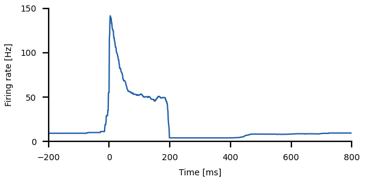
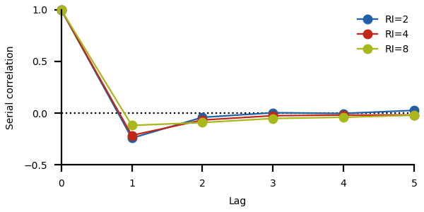

# Leaky integrate-and-fire with adaptation current

Change into the `lifac/` directory and run
``` sh
python3 lifac.py
```
for a demo.

In the following, key concepts of the model and the respective code
are briefly described. See the [`lifac.py`](lifac.py) script for the
full functions.


## The model

The leaky integrate-and-fire neuron (LIF) is extended by an adaptation
current $A$ (LIFAC, Rauch et al., 2003, Jolivet et al., 2008, Benda et
al., 2010, see Brette and Gerstner, 2005, for the exponential
integrate-and-fire neuron with adaptation):

$$\begin{align*}
\tau_m \frac{dV}{dt} &= - V + RI - A + D_v\xi \\
\tau_a \frac{dA}{dt} &= - A + D_a\xi
\end{align*}$$

The leaky integration of the membrane potential $V(t)$ with membrane
time constant $\tau_m$ is driven by a stimulus $RI$ (input resistance
$R$ times injected current $I(t)$ ) from which the adaptation current
$A$ is subtracted. The adaptation current is integrated with the
adaptation time constant $\tau_m$. $D_v\xi$ and $D_a \xi$ are additive
white noises for the membrane equation and adaptaion dynamics,
respectively. Whenever the membrane voltage crosses the firing
threshold $\theta$, a spike is generated, the adaptation current is
incremented by $\alpha$, the voltage is reset to $V_r$, and integration
is paused for the absolute refractory period $\tau_r$.

The `lifac()` function integrates the model using Euler forward integration:
``` py
def lifac(time, stimulus, taum=0.01, tref=0.003, noisedv=0.01,
          vreset=0.0, vthresh=1.0, taua=0.1, alpha=0.05, noiseda=0.01, rng=np.random):
    dt = time[1] - time[0]                                # time step
    noisev = rng.randn(len(stimulus))*noisedv/np.sqrt(dt) # properly scaled voltage noise term
    noisea = rng.randn(len(stimulus))*noiseda/np.sqrt(dt) # properly scaled adaptation noise term
    # initialization:
    tn = time[0]
    V = rng.rand()*(vthresh-vreset) + vreset
    A = 0.0
    # integration:
    spikes = []
    for k in range(len(stimulus)):
        if time[k] < tn:
            continue                 # no integration during refractory period
        V += (-V - A + stimulus[k] + noisev[k])*dt/taum   # membrane equation
        A += (-A + noisea[k])*dt/taua                     # adaptation dynamics
        if V > vthresh:              # threshold condition
            V = vreset               # voltage reset
            A += alpha/taua          # adaptation increment
            tn = time[k] + tref      # refractory period
            spikes.append(time[k])   # store spike time
    return np.asarray(spikes)
```

Use this function by first defining a time vector and an appropriate stimulus. For example,
a step stimulus of 0.3s duration:
``` py
dt = 0.0001  # integration time step in seconds
time = np.arange(-0.2, 0.8+dt, dt)
stimulus = np.zeros(len(time)) + 1.2
stimulus[(time > 0.0) & (time < 0.3)] = 4.0
```


The time step `dt` sets the integration time step. Make sure that it is at least
ten times smaller than the membrane time constant.
Then call the `lifac()` function to simulate a single trial:
``` py
spikes, v, a = lifac(time, stimulus)
```
You then can plot the membrane voltage `v` and the adaptation current
`a` as a function of time `time`.


> How does the dynamics change if you modify
> - adaptation strength
> - adaptation time constant
> - noise strength of membrane voltage or adaptation dynamics

Set these parameters by passing them to the `lifac()` function like this:
```
spikes, v, a = lifac(time, stimulus, taua=5, noisedv=0.1)
```

## Raster plot

Simulate the spikes of several trials in response to the same stimulus:
``` py
ntrials = 20
spikes = [lifac(time, stimulus)[0] for k in range(ntrials)]
```
The resulting `spikes` are a list of arrays with spike times of each trial.

They can be plotted with matplotlib's `eventplot()` function:
``` py
fig, ax = plt.subplots()
ax.eventplot(spikes, colors=['k'], lineoffsets=np.arange(1, len(spks)+1), lw=0.5)
```
Note the (black) color is given within a list.


## Spike frequency

A peri-stimulus time histogram requires a bin width for estimating the
probability of firing within a given time interval. This measure is
sensitive to the temporal precision of neuron's response to a
stimulus. It is independent of the history of the spike train.

A conceptionally different type of estimating a neuron's firing rate
is the "instantaneous firing rate" or "spike frequency". It computes
the firing rate from the inverse inter-spike intervals at a given time
point averaged over trials. This measure is largely independent of
spike time jitter and instead measures interspike intervals (ISI). No
bin or kernel width is required. At high firing rates temporal
resultion of spike freuency is higher and at low firing rate it is
lower.

For quantifying the dynamics of adaptation spike freqeuncy is more
suitable. Neural adaptation is a surathreshold phenomenon with limit
cycle firing. Firing is characterized by the period of the limit
cycle, i.e. the interspike intervals (Benda and Herz, 2003).

From the spike times the spike frequency can be computed for each time
given in a `time` array as follows:
``` py
from scipy.interpolate import interp1d

def spike_frequency(time, spikes, fill=0.0):
    zrate = 0.0 if fill == 'extend' else fill     # firing rate for empty trials
    rates = np.zeros((len(time), len(spikes)))
    for k in range(len(spikes)):                  # loop through trials
        isis = np.diff(spikes[k])                 # compute interspike intervals
        if len(spikes[k]) > 2:
	    # interpolate inverse ISIs at `time`:
            fv = (1.0/isis[0], 1.0/isis[-1]) if fill == 'extend' else (fill, fill)
            fr = interp1d(spikes[k][:-1], 1.0/isis, kind='previous',
                          bounds_error=False, fill_value=fv)
            rate = fr(time)
        else:
            rate = np.zeros(len(time)) + zrate
        rates[:,k] = rate
    frate = np.mean(rates, 1)                     # average over trials
    return frate
```

Compute the firing rate and plot it:
``` py
# a new time array with less temporal resolution than the original one:
ratetime = np.arange(time[0], time[-1], 0.001)
frate = spike_frequency(ratetime, spikes, 'extend')
fig, ax = plt.subplots(figsize=(figwidth, 0.5*figwidth))
ax.plot(1000.0*ratetime, frate)                   # time axis in milliseconds
```



> Try different values for the 
> - adaptation strength
> - adaptation time constant


## f-I curves

Three types of *f-I* curves are useful for quantifying adapting
neuronal responses: (i) the onset *f-I* curve of the unadapted neuron,
(ii) the steady-state *f-I* curve, and (iii) adapted *f-I* curves,
i.e. onset *f-I* curves measured for a preadapted neuron (Benda and
Herz, 2003).

For the first two we loop over a range of stimulus values (`inputs`),
set the stimulus to the input values, integrate the model for several
trials, compute the instantaneous firing rate and measure the onset
firing rate as the maximum rate within 50ms after stimulus onset, and
the steady-state firing rate as the averaged rate close to the end of
the stimulus:
``` py
dt = 0.0001
time = np.arange(-0.1, 0.5, dt)
stimulus = np.zeros(len(time))
inputs = np.arange(0, 10.1, 0.2)
ratetime = np.arange(time[0], time[-1], 0.001)
fon = np.zeros(len(inputs))
fss = np.zeros(len(inputs))
for i, stim in enumerate(inputs):
    stimulus[time > 0.0] = stim
    spikes = [lifac(time, stimulus)[0] for k in range(20)]
    frate = spike_frequency(ratetime, spikes, 'extend')
    fon[i] = np.max(frate[(ratetime>0.0) & (ratetime<0.05)])
    fss[i] = np.mean(frate[(ratetime>0.35) & (ratetime<0.45)])
```

For an adapted *f-I* curves the neuron needs to be preadapted to some
stimulus value, and then the onset response to a range of inputs is
measured. For this we need to know the steady-state response right
before the onset of the test stimulus (`baserate`). The onset response
is the largest deviation (positive or negative) from this rate.
``` py
prestim = 4.0
time = np.arange(-0.5, 0.3, dt)
stimulus = np.zeros(len(time)) + prestim
ratetime = np.arange(time[0], time[-1], 0.001)
fa = np.zeros(len(inputs))
for i, stim in enumerate(inputs):
    stimulus[time > 0.0] = stim
    spikes = [lifac(time, stimulus)[0] for k in range(20)]
    frate = spike_frequency(ratetime, spikes)
    baserate = np.mean(frate[(ratetime>-0.1) & (ratetime<0.0)])
    arate = frate[(ratetime>0.0) & (ratetime<0.1)]
    inx = np.argmax(np.abs(arate-baserate))
    fa[i] = arate[inx]
```


> How does the adaptated *f-I* curve behave if you change the value of
> the preadaptation stimulus?

> Again, try different values for the 
> - adaptation strength
> - adaptation time constant
>
> How do they influence the shape of the *f-I* curves?


## Baseline statistics

From the steady-state response to some stimulus you can compute
interspike-interval (ISI) histograms.

``` py
tmax = 200.0
time = np.arange(0.0, tmax, dt)
stimulus = np.zeros(len(time)) + 2.0
spikes, _, _ = lifac(time, stimulus, noiseda=0.03)
isis = np.diff(spikes[spikes>1.0])  # analyse steady-state only
bw = 0.0005                         # bin width in seconds
bins = np.arange((np.min(isis)//bw)*bw, (np.max(isis)//bw+1)*bw, bw)
ax.hist(tfac*isis, tfac*bins, density=True, label=l)
```


The ISI histograms get longer tails when the adaptation process itself
is noisy (`noiseda` argument of the `lifac()` function) (see Schwalger
et al., 2010, Fisch et al., 2012).

Compute the serial correlation between successive interspike intervals
at various lags:

``` py
max_lag = 5
lags = np.arange(0, max_lag+1)
scorr = [1.0] + [np.corrcoef(isis[k:], isis[:-k])[1,0] for k in lags[1:]]
ax.plot(lags, scorr, '-o')
```

Adaptation and additive noise in the membrane equation introduces
negative correlations at lag 1, i.e. long ISI intervals are followed
by short ones and *vice versa*.



Additive noise in the adaptation dynamics results in
Ornstein-Uhlenbeck noise in the membrane equation and thus introduces
positive ISI correlations (Schwalger et al., 2010, Fisch et al., 2012,
Farkhooi et al., 2009).

> How do the ISI histograms and the ISI correlations change if you modify
> - the noise strength on the membrane equation
> - the noise strength on the adaptation dynamics
> - the stimulus value and thus the average firing rate?


## References

> Benda J, Herz AVM (2003) A universal model for spike-frequency adaptation. *Neural Comput.* 15, 2523-2564.

> Benda J, Maler L, Longtin A (2010) Linear versus nonlinear signal transmission in neuron models with adaptation-currents or dynamic thresholds. *J. Neurophysiol.* 104, 2806-2820.

> Brette R, Gerstner W. (2005) Adaptive exponential integrate-and-fire model as an effective description of neuronal activity. *J. Neurophysiol.* 94: 3637-3642.

> Farkhooi F, Strube-Bloss MF, Nawrot MP (2009) Serial correlation in neural spike trains: Experimental evidence, stochastic modeling, and single neuron variability. *Phys Rev E* 79: 021905, 2009.

> Fisch K, Schwalger T, Lindner B, Herz AVM, Benda J (2012) Channel noise from both slow adaptation currents and fast currents is required to explain spike-response variability in a sensory neuron. *J. Neurosci.* 32, 17332-17344.

> Jolivet R, Kobayashi R, Rauch A, Naud R, Shinomoto S, Gerstner W (2008) A benchmark test for a quantitative assessment of simple neuron models. *J Neurosci Methods* 169: 417-424.

> Rauch A, Camera GL, Lüscher HR, Senn W, Fusi S (2003) Neocortical pyramidal cells respond as integrate-and-fire neurons to in vivo-like input currents. *J Neurophysiol* 90: 1598-1612.

> Schwalger T, Fisch K, Benda J, Lindner B (2010) How noisy adaptation of neurons shapes interspike interval histograms and correlations. *PLoS Comput. Biol.* 6, e1001026.


## Next

Continue reading about [spike-frequency adaptation models](../sfa/README.md).
