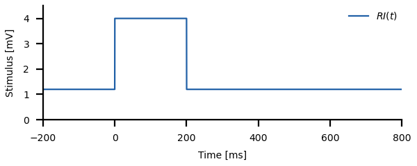
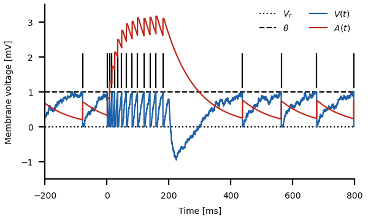
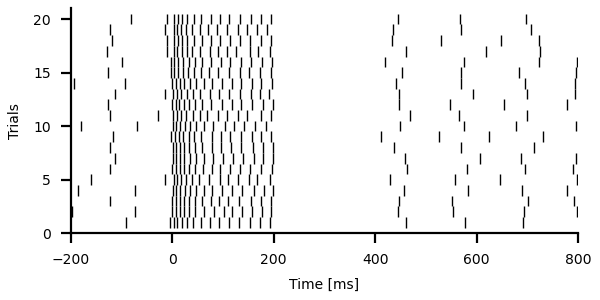

# LIFAC: leaky integrate-and-fire with adaptation current

Run
``` sh
python3 lifac.py
```
for a demo.


## The model

The leaky integrate-and-fire neuron is extended by an adaptation current *A*:


The leaky integration of the membrane potential *V(t)* with membrane
time constant *&#120591;<sub>m</sub>* is driven by a stimulus *RI* (input
resistance *R* times injected current *I(t)*) from which the
adaptation current *A* is subtracted. *D&#958;* is an additive white
noise. The adaptation current is integrated with the adaptation time
constant *&#120591;<sub>m</sub>*. Whenever the membrane voltage crosses the
firing threshold &#952;, a spike is generated, the adaptation current
is incremented by &#945;, the voltage is reset to *V<sub>r</sub>*, and
integration is paused for the absolute refractory period *&#120591;<sub>r</sub>*.

The `lifac()` function integrates the model using Euler forward integration:
``` py
def lifac(time, stimulus, taum=0.01, tref=0.003, noised=0.01,
          vreset=0.0, vthresh=1.0, taua=0.1, alpha=0.05, rng=np.random):
    dt = time[1] - time[0]                                # time step
    noise = rng.randn(len(stimulus))*noised/np.sqrt(dt)   # properly scaled noise term
    # initialization:
    tn = time[0]
    V = rng.rand()
    A = 0.0
    # integration:
    spikes = []
    for k in range(len(stimulus)):
        if time[k] < tn:
            continue                 # no integration during refractory period
        V += (-V - A + stimulus[k] + noise[k])*dt/taum    # membrane equation
        A += -A*dt/taua                                   # adaptation dynamics
        if V > vthresh:              # threshold condition
            V = vreset               # voltage reset
            A += alpha/taua          # adaptation increment
            tn = time[k] + tref      # refractory period
            spikes.append(time[k])   # store spike time
    return np.asarray(spikes)
```

Use this function by first defining a time vector and an appropriate stimulus. For example,
a step stimulus of 0.3s duration:
``` py
dt = 0.0001  # integration time step in seconds
time = np.arange(-0.2, 0.8+dt, dt)
stimulus = np.zeros(len(time)) + 1.2
stimulus[(time > 0.0) & (time < 0.3)] = 4.0
```



The time step `dt` sets the integration time step. Make sure that it is at least
ten times smaller than the membrane time constant.
Then call the `lifac()` function to simulate a single trial:
``` py
spikes, v, a = lifac(time, stimulus)
```
You then can plot the membrane voltage `v` and the adaptation current
`a` as a function of time `time`.




## Raster plot

Simulate the spikes of several trials in response to the same stimulus like this:
``` py
ntrials = 20
spikes = [lifac(time, stimulus)[0] for k in range(ntrials)]
```
The resulting `spikes` are a list of arrays with spike times of each trial.

They can be plotted with matplotlib's `eventplot()` function:
``` py
fig, ax = plt.subplots()
ax.eventplot(spks, colors=['k'], lineoffsets=np.arange(1, len(spks)+1), lw=0.5)
```
Note the (black) color is given within a list.




## Firing rate

The standard PSTH requires a bin width for estimating the probability
of firing within a given time interval. This measure is sensitive to
the temporal precision of neuron's response to a stimulus. It is
independent of the history of the spike train.

A conceptionally different type of estimating a neuron's firing rate
is the instantaneous firing rate. It computes the firing rate from the
inverse inter-spike intervals at a given time point averaged over
trials. This measure is largely independent of spike time jitter and
instead measures interspike intervals. Consequently, at high firing
rates temporal resultion is higher and at low firing rate it is lower.

For quantifying the dynamics of adaptation the instantaneous firing
rate is more suitable. Neural adaptation is a surathreshold phenomenon
with limit cycle firing. Firing is characterized by the period of the
limit cycle, i.e. the interspike intervals.

From the spike times the instantaneous firing rate can be computed for
each time given in a `time` array as follows:
``` py
def firing_rate(time, spikes, fill=0.0):
    zrate = 0.0 if fill == 'extend' else fill     # firing rate for empty trials
    rates = np.zeros((len(time), len(spikes)))
    for k in range(len(spikes)):                  # loop through trials
        isis = np.diff(spikes[k])                 # compute interspike intervals
        if len(spikes[k]) > 2:
	    # interpolate inverse ISIs at `time`:
            fv = (1.0/isis[0], 1.0/isis[-1]) if fill == 'extend' else (fill, fill)
            fr = interp1d(spikes[k][:-1], 1.0/isis, kind='previous',
                          bounds_error=False, fill_value=fv)
            rate = fr(time)
        else:
            rate = np.zeros(len(time)) + zrate
        rates[:,k] = rate
    frate = np.mean(rates, 1)                     # average over trials
    return frate
```

Compute the firing rate and plot it:
``` py
# a new time array with less temporal resolution than the original one:
ratetime = np.arange(time[0], time[-1], 0.001)
frate = la.firing_rate(ratetime, spikes, 'extend')
fig, ax = plt.subplots(figsize=(figwidth, 0.5*figwidth))
ax.plot(1000.0*ratetime, frate)                   # time axis in milliseconds
```


## f-I curves

Three types of *f-I* curves are useful for quantifying adapting
neuronal responses: (i) the onset *f-I* curve of the unadapted neuron,
(ii) the steady-state *f-I* curve, and (iii) adapted *f-I* curves,
i.e. onset *f-I* curves measured for a preadapted neuron.

For the first two we loop over a range of stimulus values (`inputs`),
set the stimulus to the input values, integrate the model for several
trials, compute the instantaneous firing rate and measure the onset
firing rate as the maximum rate within 50ms after stimulus onset, and
the steady-state firing rate as the averaged rate close to the end of
the stimulus:
``` py
dt = 0.0001
time = np.arange(-0.1, 0.5, dt)
stimulus = np.zeros(len(time))
inputs = np.arange(0, 10.1, 0.2)
ratetime = np.arange(time[0], time[-1], 0.001)
fon = np.zeros(len(inputs))
fss = np.zeros(len(inputs))
for i, stim in enumerate(inputs):
    stimulus[time > 0.0] = stim
    spikes = [lifac(time, stimulus)[0] for k in range(20)]
    frate = firing_rate(ratetime, spikes, 'extend')
    fon[i] = np.max(frate[(ratetime>0.0) & (ratetime<0.05)])
    fss[i] = np.mean(frate[(ratetime>0.35) & (ratetime<0.45)])
```

For an adapted *f-I* curves the neuron needs to be preadapted to some
stimulus value, and then the onset response to a range of inputs is
measured. For this we need to know the steady-state response right
before the onset of the test stimulus (`baserate`). The onset response
is the largest deviation (positive or negative) from this rate.
``` py
prestim = 4.0
time = np.arange(-0.5, 0.3, dt)
stimulus = np.zeros(len(time)) + prestim
ratetime = np.arange(time[0], time[-1], 0.001)
fa = np.zeros(len(inputs))
for i, stim in enumerate(inputs):
    stimulus[time > 0.0] = stim
    spikes = [la.lifac(time, stimulus)[0] for k in range(20)]
    frate = la.firing_rate(ratetime, spikes)
    baserate = np.mean(frate[(ratetime>-0.1) & (ratetime<0.0)])
    arate = frate[(ratetime>0.0) & (ratetime<0.1)]
    inx = np.argmax(np.abs(arate-baserate))
    fa[i] = arate[inx]
```


## Baseline statistics

From the steady-state response to some stimulus you can compute
interspike-interval histograms.

``` py
tmax = 200.0
time = np.arange(0.0, tmax, dt)
stimulus = np.zeros(len(time)) + 2.0
spikes, _, _ = la.lifac(time, stimulus)
isis = np.diff(spikes[spikes>1.0])  # analyse steady-state only
bw = 0.0005                         # bin width in seconds
bins = np.arange((np.min(isis)//bw)*bw, (np.max(isis)//bw+1)*bw, bw)
ax.hist(tfac*isis, tfac*bins, density=True, label=l)
```


Or the serial correlation between successive interspike intervals at various lags:

``` py
max_lag = 5
lags = np.arange(0, max_lag+1)
scorr = [1.0] + [np.corrcoef(isis[k:], isis[:-k])[1,0] for k in lags[1:]]
ax.plot(lags, scorr, '-o')
```


