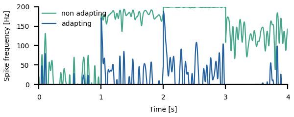
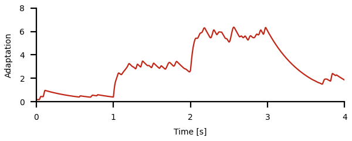
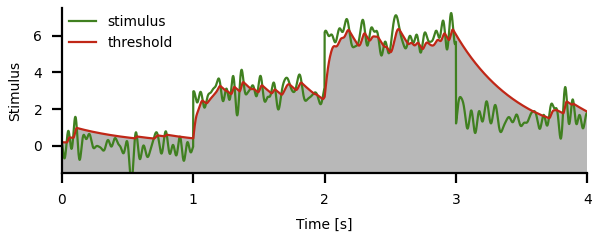
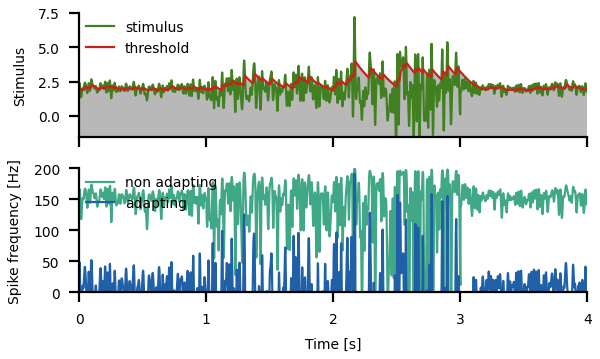
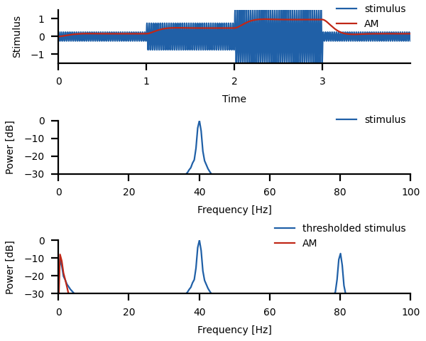

# Adaptation to stimulus mean and variance

Change into the `meanvariance/` directory and run
``` sh
python3 meanvariance.py
```
for a demo.

In the following, key concepts of adaptation to the mean, computation
of the amplitude modulation, and adaptation to the variance, as well
as the respective code are briefly described. See the
[`meanvariance.py`](meanvariance.py) script for the full functions.


## Subtractive adaptation to the mean

Let's generate a stimulus with stepwise different mean values. For
this we create a longer white-noise stimulus and a corresponding
array with the mean values that then is added to the noise stimulus.

``` py
dt = 0.001                    # integration time step in seconds
tmax = 4.0                    # stimulus duration in seconds
cutoff = 20.0                 # cutoff frequency of white noise in Hertz
T = 1.0                       # duration of segements with constant mean in seconds
means = [0.0, 3.0, 6.0, 1.5]  # mean stimulus values for each segment
# white noise stimulus:
stimulus = 0.5*whitenoise(0.0, cutoff, dt, tmax)
time = np.arange(len(stimulus))*dt
# array with means:
mean = np.zeros(len(stimulus))
for k, m in enumerate(means):
    mean[(time>k*T) & (time<=(k+1)*T)] += m
# add mean values to stimulus:
stimulus += mean
# plot:
ax.plot(time, stimulus)
ax.plot(time, mean)
```


Compute the spike-frequency response of a non-adaptating neuron
(&#120572; = 0)
``` py
rate0, adapt0 = adaptation(time, stimulus, alpha=0.0, taua=0.5)
```
and of a strongly adapting neuron (&#120572; = 0.2) to this stimulus
``` py
rate, adapt = adaptation(time, stimulus, alpha=0.2, taua=0.5)
```
and plot the resulting spike frequencies:

``` py
ax.plot(time, rate0)
ax.plot(time, rate)
```



Without adaptation, the spike-frequency responses of the neuron
quickly saturate and do not convey the fast stimulus components
faithfully.

Spike-frequency adaptation removes most of the different mean values,
but not completely. The stronger the adaptation (higher &#120572;),
the more the mean values will be attenuated. Because of adaptation,
spike-frequency responses are not saturated. The non-linear shape of
the neuron's *f-I* curves (spike frequencies cannot be negative) cuts
out parts of the stimulus below the mean. Whenever the stimuls mean
switches to higher values, the neuron transiently responds with a high
spike frequency that then decays to lower levels.  When the mean is
switched to lower values, the neuron ceases firing until it recovers
from adaptation.

The adaptation variable quickly adapts to the new mean values and then fluctuates
only slightly around the new value. Recovery from adaptation takes much longer.

``` py
ax.plot(time, adapt)
```



Since the adaptation variable is given in units of the stimulus, and
it governs the shift of the neuron's *f-I* curve along the stimulus
axis, we can plot it on top of the stimulus.  In our model, the
rheobase of the unadapted *f-I* curve is at zero.  Therefore the
adaptation variable can be read as the time course of the rheobase of
the neuron.

``` py
ax.plot(time, stimulus)
ax.fill_between(time, adapt, -1.5, fc='gray', alpha=0.75)
ax.plot(time, adapt)
```



Stimulus values (green) below the current value of the rheobase (red)
are not transmitted by the neuron (gray shading). Compare the time
course of the stimulus above the rheobase with the time course of the
resulting spike frequency above.

Instead of step-wise constant mean stimulus values we can slowly vary
the mean, for example by a cosine function:
``` py
cutoff = 40.0                 # cutoff frequency of white noise in Hertz
stimulus = 0.5*whitenoise(0.0, cutoff, dt, tmax)
time = np.arange(len(stimulus))*dt
mean = 3.0*(1.0-np.cos(2.0*np.pi*time/time[-1]))
stimulus += mean
```


Adaptation follows this slow change in stimulus amplitude and shifts
the neuron's *f-I* curve accrodingly to the current stimulus
amplitudes. This way saturation of the response is prevented and the
fast stimulus components are faithfully transmitted.

> Repeat the examples and vary
> - the adaptation time constant
> - the adaptation strength
> - the cutoff frequency of the stimulus
> - the duration of the steps/the frequency of the cosine


## Subtractive adaptation to variance of a stimulus

What about stimuli with modulated variance? We can construct such a
stimulus in similar ways.
``` py
dt = 0.001                    # integration time step in seconds
tmax = 4.0                    # stimulus duration in seconds
cutoff = 60.0                 # cutoff frequency of stimulus in Hertz
T = 1.0                       # duration of segements with constant mean in seconds
stdevs = [0.5, 1.5, 3.0, 0.5] # standard deviations for each segment
# white noise stimulus:
stimulus = 0.5*whitenoise(0.0, cutoff, dt, tmax)
time = np.arange(len(stimulus))*dt
# array with standard deviations:
std = np.zeros(len(stimulus))
for k, s in enumerate(stdevs):
    std[(time>k*T) & (time<=(k+1)*T)] += s
# apply standard deviations to white noise stimulus:
stimulus *= std
# also add a mean value:
stimulus += 2.0
```

The same neuron from above responds in the following way to this stimulus:



Although the mean of the stimulus is constant, the adaptation variable
somehow tracks the changes in stimulus variance. This is possible,
because of the non-linear shapes of the neuron's *f-I* curves
(sigmoidal Boltzman functions). They cut out the lower stimulus values
and that way the resulting spike-frequency does not have a constant
mean. The mean value of the resulting spike-frequency increases with
stimulus variance. But because the neuron's *f-I* curve is shifted,
the response is not invariant to the changes in stimulus variance,
peak spike frequencies increase with stimulus variance.


## Extracting the amplitude modulation

How to extract the current variance of the stimulus? The (square root
of the) variance of the stimulus is also known as its amplitude
modulation. A common method to extract the amplitude modulation is to
first threshold the (mean-free) signal at zero, i.e. set all negative
values of the stimulus to zero. This makes the stimulus asymmetric and
the amplitude modulation appears as low-frequency components in its
power spectrum. One then can filter the thresholded stimulus to
isolate this low-frequency information and this way retrieve the
amplitude modulation.

``` py
def amplitude_modulation(signal, dt, fcutoff):
    signal = np.array(signal)
    signal[signal<0.0] = 0.0
    sos = sig.butter(2, fcutoff, 'lp', fs=1.0/dt, output='sos')
    am = 2.0*sig.sosfilt(sos, signal)
    return am
```

This is best illustrated with a sine wave as a carrier that is then
modulated in its amplitude in the same way as the white noise stimulus from above.
``` py
fstim = 40.0
time = np.arange(0.0, tmax, dt)
stimulus = 0.5*np.sin(2.0*np.pi*fstim*time)
```
We then compute the amplitude modulation with a low-pass filter at 2Hz:
``` py
am = amplitude_modulation(stimulus, dt, 2.0)
ax.plot(time, stimulus)
ax.plot(time, am)
```



The stimulus has a peak at the carrier frequency of 40Hz. This peak is
broadened by the amplitude modulation. Thresholding this signal results in
harmonics of the carrier frequency, but also in a peak at zero frequency.
This low-frequency component is the amplitude modulation.


## Adaptation to the variance

