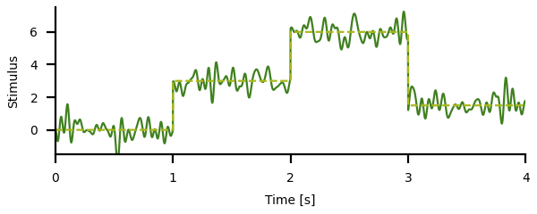
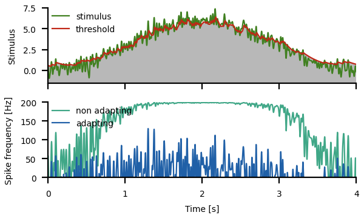

# Adaptation to stimulus mean and variance

Change into the `meanvariance/` directory and run
``` sh
python3 meanvariance.py
```
for a demo.

In the following, key concepts of adaptation to the mean, computation
of the amplitude modulation, and adaptation to the variance, as well
as the respective code are briefly described. See the
[`meanvariance.py`](meanvariance.py) script for the full functions.


## Adaptation to the mean

Let's generate a stimulus with stepwise different mean values. For
this we create a longer white-noise stimulus and a corresponding
array with the mean values that then is added to the noise stimulus.

``` py
dt = 0.001                    # integration time step in seconds
tmax = 4.0                    # stimulus duration in seconds
cutoff = 20.0                 # cutoff frequency of white noise in Hertz
T = 1.0                       # duration of segements with constant mean in seconds
means = [0.0, 3.0, 6.0, 1.5]  # mean stimulus values for each segment
# white noise stimulus:
stimulus = 0.5*whitenoise(0.0, cutoff, dt, tmax)
time = np.arange(len(stimulus))*dt
# array with means:
mean = np.zeros(len(stimulus))
for k, m in enumerate(means):
    mean[(time>k*T) & (time<=(k+1)*T)] += m
# add mean values to stimulus:
stimulus += mean
# plot:
ax.plot(time, stimulus)
ax.plot(time, mean)
```



Compute the spike-frequency response of a non-adaptating neuron
(&#120572; = 0)
``` py
rate0, adapt0 = adaptation(time, stimulus, alpha=0.0, taua=0.5)
```
and of a strongly adapting neuron (&#120572; = 0.2) to this stimulus
``` py
rate, adapt = adaptation(time, stimulus, alpha=0.2, taua=0.5)
```
and plot the resulting spike frequencies:

``` py
ax.plot(time, rate0)
ax.plot(time, rate)
```


Without adaptation, the spike-frequency responses of the neuron
quickly saturate and do not convey the fast stimulus components
faithfully.

Spike-frequency adaptation removes most of the different mean values,
but not completely. The stronger the adaptation (higher &#120572;),
the more the mean values will be attenuated. Because of adaptation,
spike-frequency responses are not saturated. The non-linear shape of
the neuron's *f-I* curves (spike frequencies cannot be negative) cuts
out parts of the stimulus below the mean. Whenever the stimuls mean
switches to higher values, the neuron transiently responds with a high
spike frequency that then decays to lower levels.  When the mean is
switched to lower values, the neuron ceases firing until it recovers
from adaptation.

The adaptation variable quickly adapts to the new mean values and then fluctuates
only slightly around the new value. Recovery from adaptation takes much longer.

``` py
ax.plot(time, adapt)
```


Since the adaptation variable is given in units of the stimulus, and
it governs the shift of the neuron's *f-I* curve along the stimulus
axis, we can plot it on top of the stimulus.  In our model, the
rheobase of the unadapted *f-I* curve is at zero.  Therefore the
adaptation variable can be read as the time course of the rheobase of
the neuron.

``` py
ax.plot(time, stimulus)
ax.fill_between(time, adapt, -1.5, fc='gray', alpha=0.75)
ax.plot(time, adapt)
```


Stimulus values (green) below the current value of the rheobase (red)
are not transmitted by the neuron (gray shading). Compare the time
course of the stimulus above the rheobase with the time course of the
resulting spike frequency above.

Instead of step-wise constant mean stimulus values we can slowly vary
the mean, for axample by a cosine function:
``` py
cutoff = 40.0                 # cutoff frequency of white noise in Hertz
stimulus = 0.5*whitenoise(0.0, cutoff, dt, tmax)
time = np.arange(len(stimulus))*dt
mean = 3.0*(1.0-np.cos(2.0*np.pi*time/time[-1]))
stimulus += mean
```



Adaptation follows this slow change in stimulus amplitude and shifts
the neuron's *f-I* curve accrodingly to the current stimulus
amplitudes. This way saturation of the response is prevented and the
fast stimulus components are faithfully transmitted.


## Computing the amplitude modulation


## Adaptation to the variance

