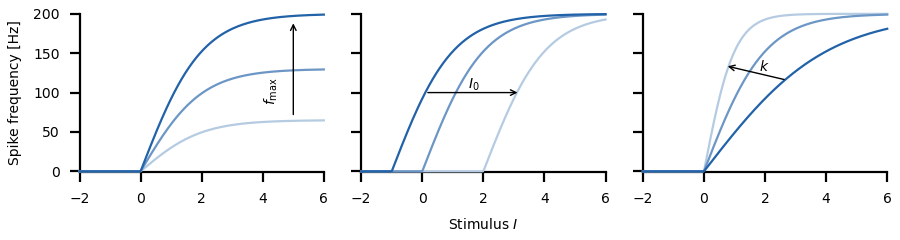

# Spike-frequency adaptation models

Change into the `sfa/` directory and run
``` sh
python3 sfa.py
```
for a demo.

In the following, key concepts of the model and the respective code
are briefly described. See the [`sfa.py`](sfa.py) script for the full
functions.


## Subtractive adaptation

Spike-frequency adaptation is caused by many different kinds of
adaptation current. For example, voltage-gated M-type current or
calcium activated potassium currents. Since these currents flow across
the cell membrane in parallel to all other ionic currents, inclusively
the input current, they subtractively act on the input current. Their
dynamics usually is a first order low-pass filter driven by the
spike-frequency of the neuron. This results in the following model
(see Benda and Herz, 2003, for details):

$$\begin{align*}
f &= f_0(I-A) \\
\tau_a \dot A &= - A + \alpha f
\end{align*}$$

where $\tau_a$ is the adaptation time constant, $\alpha$
is the adaptation strength, $f(t)$ is the spike frequency,
$f_0(I)$ is the onset (unadapted) *f-I* curve, $I(t)$ the
input, and $A(t)$ is the adaptation level, i.e. the temporally
averaged adaptation current.

Let's model a saturating onset *f-I* curve by the upper half of a
Boltzman function:

```math
\begin{align*}
f_0(I) &= \left\{ \begin{array}{rcl} f_{\rm max}\frac{2}{1+e^{-k(I-I_0)}} - 1 & ; & I > I_0 \\ 0 & ; & I < I_0 \end{array} \right.
\end{align*}
```

where $f_{\rm max}$ is the maximum firing rate, $I_0$ is the rheobase, i.e. the position of the *f-I* curve on the stimulus axis, and $k$ sets the slope of the dynamic range.

Here is the code for both scalars and arrays as inputs:
``` py
def upper_boltzmann(I, fmax=1.0, I0=0.0, slope=1.0):
    rate = fmax*(2.0/(1.0+np.exp(-slope*(I-I0))) - 1.0)
    if np.isscalar(rate):
        if rate < 0.0:
            rate = 0.0
    else:
        rate[rate<0] = 0.0
    return rate
```



> Plot the `upper_boltzmann()` function for various values of the three parameters.

Using this parametrization of the onset *f-I* curve we can implement
the model using the Euler forward method:
``` py
def adaptation(time, stimulus, taua=0.1, alpha=1.0, slope=1.0, I0=0.0, fmax=200.0):
    dt = time[1] - time[0]
    # integrate to steady-state of first stimulus value:
    a = 0.0
    for k in range(int(5*taua//dt)):
        f = upper_boltzmann(stimulus[0] - a, fmax, I0, slope)
        a += (alpha*f - a)*dt/taua
    # integrate:
    rate = np.zeros(len(stimulus))
    adapt = np.zeros(len(stimulus))
    for k in range(len(stimulus)):
        adapt[k] = a
        rate[k] = f
        f = upper_boltzmann(stimulus[k] - a, fmax, I0, slope)
        a += (alpha*f - a)*dt/taua
    return rate, adapt
```

The spike-frequency response to a step can be computed and plotted like this:
``` py
time = np.arange(-0.05, 0.3, 0.001)
stimulus = np.zeros(len(time)) + 1.0
stimulus[(time > 0.0) & (time < 0.1)] = 3.0
rate, adapt = sfa.adaptation(time, stimulus, alpha=0.05)
axf.plot(1000.0*time, rate, 'b')
axa.plot(1000.0*time, adapt, 'r')
```


Note that the effective time constant of adaptation during the step is
much faster than the one after the step (Benda and Herz, 2003, Benda
et al., 2005).

> Compute the step response for various values of the
> - adaptation strength
> - adaptation time constant
> - values of the step stimulus


## *f-I* curves

By definition of the model, the onset *f-I* curve is $f_0(I)$ and the
adapted *f-I* curves $f_a(I) = f_0(I-A)$ are shifted versions of
it. For a linear onset *f-I* curve, $f_0(I)=cI$ the resulting
steady-state *f-I* curve reads

$$f_{\infty} = \frac{I}{1/c + \alpha}$$

Increasing adaptation strengh $\alpha$ reduces the gain of the
steady-state *f-I* curve.

For non-linear *f-I* curves we can compute the steady-state f-I curve
and the adapted *f-I* curves numerically:

``` py
dt = 0.0001               # integration time step in seconds
time = np.arange(-0.05, 0.5, dt)
inputs = np.arange(-2, 6.1, 0.1)
# onset and steady state f-I curves:
stimulus = np.zeros(len(time))
f0 = []
fs = []
for s in inputs:
    stimulus[time>0.0] = s
    rate, _ = sfa.adaptation(time, stimulus, alpha=0.05)
    f0.append(np.max(rate))
    fs.append(rate[-1])
# one adapted f-I curve:
time = np.arange(-0.05, 0.1, dt)
stimulus = np.zeros(len(time)) + 2.0
fa = []
for s in inputs:
    stimulus[time>0.0] = s
    rate, _ = sfa.adaptation(time, stimulus, alpha=0.05)
    fb = np.mean(rate[(time>-0.05)&(time<0.0)])
    arate = rate[(time>0.0) & (time<0.1)]
    inx = np.argmax(np.abs(arate-fb))
    fa.append(arate[inx])
```


Note the linearizing effect of adaptation on the steady-state *f-I* curve
(Ermentrout, 1998).

> Compute adapted *f-I* curves for various values of the preadaptation stimulus.

> How do the three types of *f-I* curves change their shape if you vary
> - adaptation strength
> - adaptation time constant


## Spike generator

The spike frequency, i.e. the inverse interspike intervals, can not
follow arbitrary fast changes of the input stimulus. To a first
approximation, a neuron integrates the firing rate along its limit
cycle. The time $T$ it needs to get once around the limit cycle,
i.e. the interspike interval, is reached when the integral over the
firing rate equals one:

$$\int_{-\frac{T}{2}}^{+\frac{T}{2}} f(t) \, dt = 1$$

This can be applied on the firing rates returned by the adaptation
model as follows:
``` py
def isi_lowpass(time, rate, time_centered=False):
    dt = time[1] - time[0]                           # integration time step
    # extend spike frequency on both ends to avoid edge effects:
    lidx = int(np.ceil(1.0/rate[0]/dt))+1 if rate[0] > 0.0 else len(rate)
    ridx = int(np.ceil(1.0/rate[-1]/dt))+1 if rate[-1] > 0.0 else len(rate)
    rr = np.hstack(([rate[0]]*lidx, rate, [rate[-1]]*ridx))
    tt = np.arange(len(rr))*dt + time[0] - lidx*dt   # new time array  
    # integrate the firing rate to a phase:
    phi = np.cumsum(rr)*dt
    # find integration limits:
    t0 = np.interp(phi-0.5, phi, tt)
    t1 = np.interp(phi+0.5, phi, tt)
    frate = 1.0/(t1 - t0)
    if time_centered:
        tc = (t0 + t1)/2.0
        return np.interp(time, tc, frate)
    else:
        return frate[lidx:-ridx]
```

Note that this is not a low-pass filter with a fixed cutoff
frequency. The cutoff frequency depends on the current spike
frequency. Fast fluctuations in the stimulus can be better resolved
with a high spike frequency (Knight, 1972).

Just run this function on the rate returned by the adaptation model:
```
frate = isi_lowpass(time, rate)
```


> Compare the low-pass filtered rate with the spike frequency returned
> from the model for a pulse train as a stimulus. Vary the frequency
> and the duty cycle of the pulses.


## References

> Benda J, Herz AVM (2003) A universal model for spike-frequency adaptation. *Neural Comput.* 15, 2523-2564.

> Benda J, Longtin A, Maler L (2005) Spike-frequency adaptation separates transient communication signals from background oscillations. *J Neurosci* 25: 2312-2321.

> Ermentrout B (1998) Linearization of f-I curves by adaptation. *Neural Comput* 10: 1721-1729.

> Knight, BW (1972) Dynamics of encoding in a population of neurons. *J Gen Physiol* 59: 734-766.

## Next

Continue reading about [adaptation high-pass filter](../filter/README.md).
