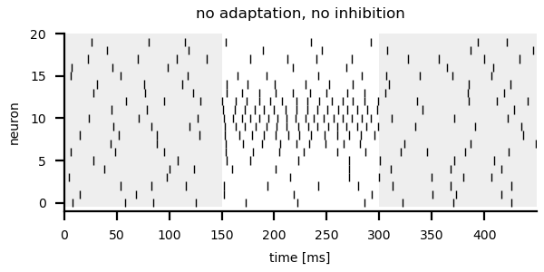
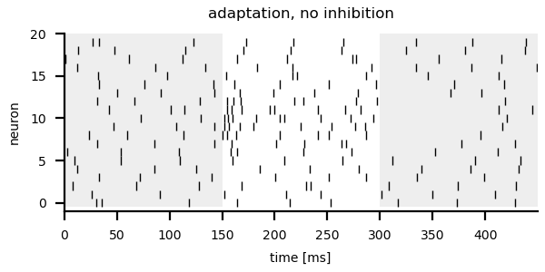
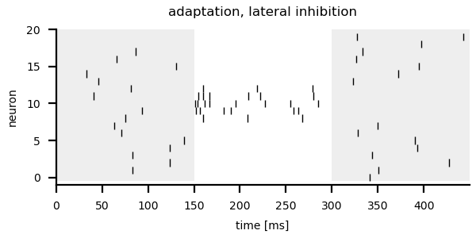

# Generating sparse codes

Change into the `sparse/` directory and run
``` sh
python3 sparse.py
```
for a demo.

Intrinsic adaptation generates temporal sparseness and lateral
inhibition spatial sparseness. See the [`sparse.py`](sparse.py) script
for the full functions.


## No adaptation, no inhibition

We take the [leaky integrate-and-fire model with adaptation
current](../lifac/README.md#the-model) and set the adaptation strength
to zero: `alpha=0.0`. We modified the function to not store and return the voltage
and adaptation traces. This function is now called `lifac_spikes()`.

Each of the `n` neurons `k` receives the common stimulus with
different strength. We here model this spatial stimulus profile by a
Gaussian function centered on the central neuron `0.5*n` with a
standard deviation `0.1*n` so that only the central half of the
neurons gets a substantial input.
```
ge = np.exp(-0.5*((k-0.5*n)/(0.1*n))**2)
```


The input to each neuron is a rectangular stimulus waveform
`stimulus`, scaled by the Gaussian `ge` and with an appropriate offset
and scaling factor to result in suitable firing rates:
```
0.95+1.2*ge*stimulus
```

We simulate for each neuron a single trial:
```
n = 20                              # number of neurons
ton = 0.15                          # onset time of stimulus
toff = 2*ton                        # offset time of stimulus
dt = 0.0005                         # integration time step
time = np.arange(0.0, toff+ton, dt)
stimulus = np.zeros(len(time))      # rectangular stimulus
stimulus[(time>ton) & (time<toff)] = 1.0
spikes = []
# loop over all the neurons:
for k in range(n):
    # Gaussian excitation profile modelling the stimulus input:
    ge = np.exp(-0.5*((k-0.5*n)/(0.1*n))**2)
    spks = lifac_spikes(time, 0.95+1.2*ge*stimulus, taua=0.1, taum=0.01, alpha=0.0,
                        noisedv=0.01)
    spikes.append(1000.0*spks)      # milliseconds
# plotting in milliseconds:
ax.eventplot(spikes, colors=['k'], lw=0.5)
```

Without intrinsic adaptation and without lateral inhibition a stimulus
evokes a sustained response in the independent neurons. 



> Try different positions and standard deviations of the Gaussian stimulus profile.

> Vary the offset and scaling factor for the stimulus.


## Adaptation, no inhibition

We switch on intrinsic adaptation by setting the adaptation strength
`alpha` to an appropriate non-zero value. To keep the firing rates
similar to the previous case we have to readjust the stimulus offset
and scaling factor:

```
spikesa = []
for k in range(n):
    # Gaussian excitation profile modelling the stimulus input:
    ge = np.exp(-0.5*((k-0.5*n)/(0.1*n))**2)
    spks = lifac_spikes(time, 12.0+1.2*16.6*ge*stimulus, taua=0.1, taum=0.01, alpha=0.7,
                        noisedv=0.2)
    spikesa.append(1000.0*spks)     # milliseconds
```

The resulting response profile is temporally sparse, because the
intrinsic adaptation quickly reduces the response to the rectangular
stimulus. But still all of the neurons are firing.

Adaptation removes temporal redundancy by subtracting slow,
predictable stimulus components.



> Vary adaptation time constant and strength.


## No adaptation, lateral inhibition

To add lateral inhibition to the model we are lazy and just subtract a
fixed offset from the spatial stimulus profile. In this way the
lateral inhibition is a inhibition that effects all neurons in the
same way and is driven by the stimulus. This certainly is an
oversimplification but it makes the point clear.
```
spikesi = []
for k in range(n):
    # Gaussian excitation profile modelling the stimulus input:
    ge = np.exp(-0.5*((k-0.5*n)/(0.1*n))**2)
    # Lateral inhibition simply reduces the excitation:
    gei = 2.4*ge - 1.0
    spks = lifac_spikes(time, 0.95+gei*stimulus, taua=0.1, taum=0.01, alpha=0.0,
                        noisedv=0.01)
    spikesi.append(1000.0*spks)
```


Now only the central neurons get enough excitation to properly respond
during the stimulus and the other ones are suppressed in their firing,
but only during the stimulation.

Lateral inhibition removes spatial redundancies by subtracting the
activity form neighboring neurons that most likely have similar
responses.


> Change the profile for the inhibition.


## Adaptation, lateral inhibition

Combining both intrinsic adaptation and lateral inhibition is straight forward:
```
spikesai = []
for k in range(n):
    # Gaussian excitation profile modelling the stimulus input:
    ge = np.exp(-0.5*((k-0.5*n)/(0.1*n))**2)
    # Lateral inhibition simply reduces the excitation:
    gei = 2.4*ge - 1.0
    spks = lifac_spikes(time, 0.0+16.6*gei*stimulus, taua=0.1, taum=0.01, alpha=0.7,
                        noisedv=0.2)
    spikesai.append(1000.0*spks)
```

And we get a temporally and spatially sparse response. Both temporal
and spatial redundancies are reduced.



> Read the Betkiewicz et al. (2020) paper for more hints on how to
> properly model a proper network of integrate-and-fire neurons.


## References

> Betkiewicz R, Lindner B, Nawrot MP (2020) Circuit and cellular mechanisms facilitate the transformation from dense to sparse coding in the insect olfactory system. *eNeuro* 7: ENEURO.0305-18.2020.
