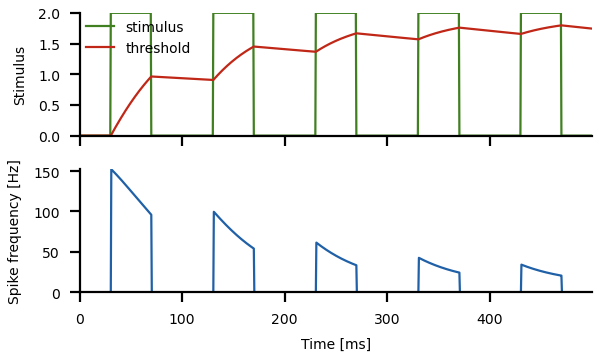

# Stimulus-specific adaptation

Change into the `ssa/` directory and run
``` sh
python3 ssa.py
```
for a demo.

In the following a few simple models illustrating stimulus-specific
adaptation are introduced. See the [`ssa.py`](ssa.py) script for the
full functions.


## Adaptation to pulse trains

Let's generate a periodic pulse train as a stimulus
``` py
n = 5              # number of pulses
T = 0.1            # period of the pulses in seconds
t0 = 0.03          # start of the pulse within the period in seconds
t1 = 0.07          # end of the pulse within the period in seconds
dt = 0.0005        # integration time step in seconds
time = np.arange(0.0, n*T, dt)
stimulus = np.zeros(len(time))
stimulus[(time%T>t0) & (time%T<t1)] = 2.0
```
Key is the modulo operation `%`. `time % T` is the remainder of the
division of `time` by the period `T`. For example, `2.3 % 2.0 = 0.3`.

> Print the values of the `time` array and compare them to 
> `time % > T`. Try differnt values of `T`.

Feed this stimulus into an adapting neuron:

``` py
rate, adapt = adaptation(time, stimulus, alpha=0.2, taua=1.0)
```



Note that the effective adaptation time constant during the pulses is
much shorter than in between the pulses. Because of this asymmetry the
neuron adapts quickly during the pulses but recovers relatively slowly
in between. That way adaptation accumulates from pulse to pulse even
with relatively short pulses. See Benda and Herz, 2003, for a detailed
discussion of the relation between the adaptation time constant of the
adaptation mechanism and the effective time constant that can be
observed on the level of the spike frequency.


## References

> Benda J, Herz AVM (2003) A universal model for spike-frequency adaptation. *Neural Comput.* 15, 2523-2564.

> Whitmire CJ, Stanley GB (2016) Rapid sensory adaptation redux: a circuit perspective. *Neuron* 92: 298–315.
