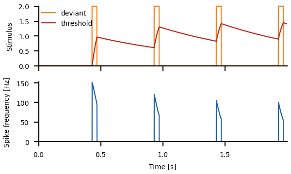

# Stimulus-specific adaptation

Change into the `ssa/` directory and run
``` sh
python3 ssa.py
```
for a demo.

In the following a few simple models illustrating stimulus-specific
adaptation are introduced. See the [`ssa.py`](ssa.py) script for the
full functions.


## Adaptation to pulse trains

A common experimental protocoll for stimulus-specific adaptation are
periodic stimuli, where a stimulus is repeatably presented.  Let's
generate a periodic pulse train as a stimulus
``` py
n = 5              # number of pulses
T = 0.1            # period of the pulses in seconds
t0 = 0.03          # start of the pulse within the period in seconds
t1 = 0.07          # end of the pulse within the period in seconds
dt = 0.0005        # integration time step in seconds
time = np.arange(0.0, n*T, dt)
stimulus = np.zeros(len(time))
stimulus[(time%T>t0) & (time%T<t1)] = 2.0
```
Key is the modulo operation `%`. `time % T` is the remainder of the
division of `time` by the period `T`. For example, `2.3 % 2.0 = 0.3`.

> Print the values of the `time` array and compare them to 
> `time % T`. Try different values of `T`.

Feed this stimulus into an adapting neuron:

``` py
rates, adapts = adaptation(time, stimulus, alpha=0.2, taua=1.0)
```


Note that the effective adaptation time constant during the pulses is
much shorter than in between the pulses. Because of this asymmetry the
neuron adapts quickly during the pulses, but recovers relatively
slowly in between. That way adaptation accumulates from pulse to pulse
even with relatively short pulses. See Benda and Herz (2003) for a
detailed discussion of the relation between the adaptation time
constant of the adaptation mechanism and the effective time constant
that can be observed on the level of the spike frequency.

> Try different values for the adaptation time constant and the
> adaptation strength.

The stimulus can also be a function of the time modulo the period. For
example, to generate a sawtooth with falling flanks:

``` py
stimulus = 1.0 - (time%T)/T
```


> Generate
> - a sawtooth stimulus with rising flanks
> - a triangular stimulus
> - a stimulus where each pulse is a parabula.

A variant of generating periodic stimuli is to start out with a
sinewave and modify it, for example by squaring it, to make the pulses
more narrow:

``` py
stimulus = 0.5*(1.0 - np.cos(2.0*np.pi*time/T))
stimulus = stimulus**2
```


> Try different powers larger and smaller than one.


## Adaptation to a deviant stimulus

For testing stimulus-specific adaptation we also need a "deviant" stimulus
that contains a pulse only every *m*-th period.

``` py
m = 5                                  # deviant on every m-th pulse
deviant = np.array(stimulus)           # copy the standard stimulus
deviant[time%(m*T) < (m-1)*T] = 0.0    # set the firs m-1 pulses to zero 
```

For a cosine stimulus with 20 periods this looks like this:


The standard stimulus is plotted in green, the deviant one in orange.

The deviant stimulus is also encoded by an adapting neuron:
``` py
rated, adaptd = adaptation(time, deviant, alpha=0.2, taua=1.0)
```

Using the pulse stimulus from above with 20 periods and only taking
every 5-th pulse results the following response:



The neuron still adapts to the deviant, but much less compared to the
standard pulse stimulus.

> Change the overall number of pulses and the sparsity of the deviant
> stimulus.


## Stimulus-specific adaptation

In its simple form, the target neuron simply adds up the responses of
the neuron encoding the standrad stimulus and of the neuron encoding
the deviant stimulus.

``` py
rate = rates + rated
```


Clearly, the deviant evokes almost unadapted responses, whereas the
standard stimulus stays strongly adapted.

> Test the robustness of stimulus-specific adaptation. How does it
> depend on stimulus properties, like pulse duration, pulse waveform,
> sparsity of the deviant, etc.

> Add adaptaton to the target neuron. How does this effect the
> stimulus-specific adaptation?


## References

> Benda J, Herz AVM (2003) A universal model for spike-frequency adaptation. *Neural Comput.* 15, 2523-2564.

> Presern J, Triblehorn JD, Schul J (2015) Dynamic dendritic compartmentalization underlies stimulus-specific adaptation in an insect neuron. *J Neurophysiol* 113: 3787-3797.

> Whitmire CJ, Stanley GB (2016) Rapid sensory adaptation redux: a circuit perspective. *Neuron* 92: 298–315.


## Next

Continue reading about [resolving ambiguities](../ambiguities/README.md).
